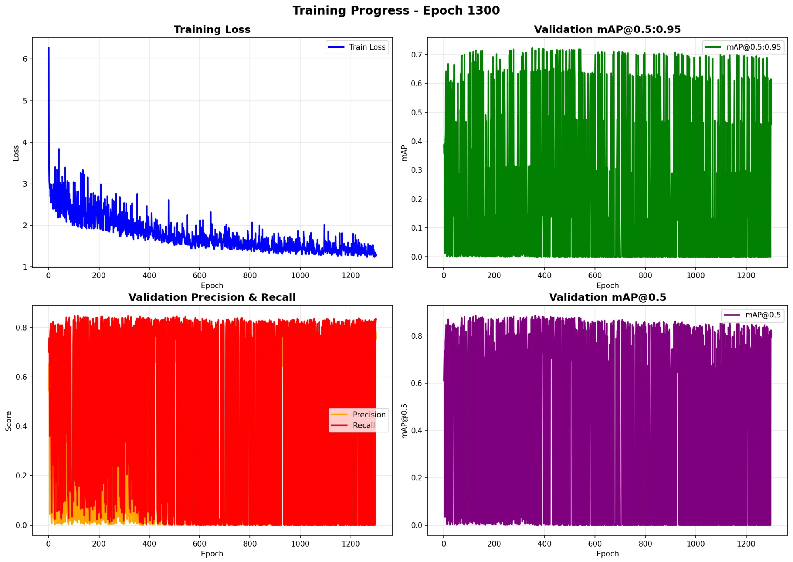
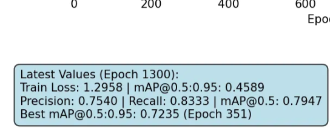
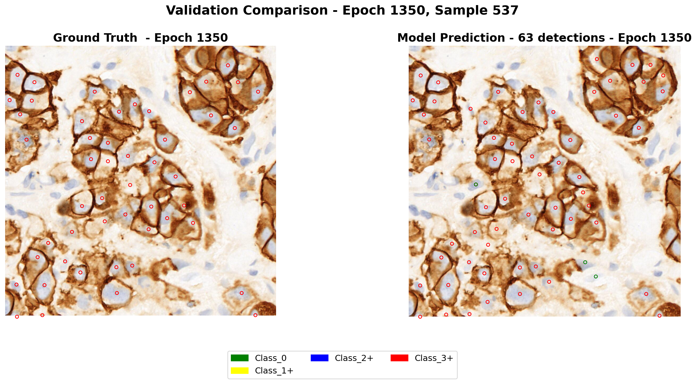

# Cell Level Her2 score 알고리즘

담당자: 영섭 이
진행 상태: 보관
프로젝트: IHC 바이오마커 AI (https://www.notion.so/IHC-AI-26142971c02f80b98f34fb6ee0ae865b?pvs=21)
하위 작업: IHC 세포 검출 알고리즘 배율 unification (https://www.notion.so/IHC-unification-27342971c02f8061821cdd2d2ed56220?pvs=21), Auto Labeling (https://www.notion.so/Auto-Labeling-27642971c02f8077892be22adbfa29c8?pvs=21), training before inspection (https://www.notion.so/training-before-inspection-27742971c02f80e18994d5169dd0c27b?pvs=21)
git repositories: https://github.com/Leeyoungsup/Cell_Level_Her2_score_coefficient

# Dataset

### 개요

- “HER2-IHC-40x” 및 “HER2-IHC-40x-WSI” 데이터셋은 유방암(HER2 immunohistochemistry, IHC) 병리 조직 슬라이드의 whole-slide image(WSI)와, 이로부터 추출한 패치(patch, 일정 크기 이미지 조각)들을 포함함.
- 목적은 HER2 IHC 점수 (0, 1+, 2+, 3+)을 자동 또는 딥러닝 기반으로 판단(soring)하는 계산 병리학(computational pathology) 연구를 지원하기 위함.

---

### 구성 및 스펙

| 항목 | 내용 |
| --- | --- |
| 총 WSIs 수 | **107** 장. [DOAJ](https://doaj.org/article/dfc7be96489b4a2daf5be1d5d141d044?utm_source=chatgpt.com) |
| 배율 / 해상도 | 40× (즉 고배율 스캔) [DOAJ+1](https://doaj.org/article/dfc7be96489b4a2daf5be1d5d141d044?utm_source=chatgpt.com) |
| ROI (Region of Interest) | 전문가 병리학자들이 슬라이드 상에서 관심(region) 지정됨. 병소 부위 및 유의미한 조직 영역 중심. [DOAJ](https://doaj.org/article/dfc7be96489b4a2daf5be1d5d141d044?utm_source=chatgpt.com) |
| Patch 크기 | 1024 × 1024 픽셀 패치들이 ROI에서 추출됨. [DOAJ](https://doaj.org/article/dfc7be96489b4a2daf5be1d5d141d044?utm_source=chatgpt.com) |
| 클래스 (HER2 점수) | 4개 클래스: **0, 1+, 2+, 3+** [DOAJ](https://doaj.org/article/dfc7be96489b4a2daf5be1d5d141d044?utm_source=chatgpt.com) |
| 데이터 정제 (filtering) | 색상 히스토그램(color histogram) 기반 필터링 → tumor/non-tumour 영역 및 artifacts 제거됨. [DOAJ](https://doaj.org/article/dfc7be96489b4a2daf5be1d5d141d044?utm_source=chatgpt.com) |

---

### 데이터 분할 전략

두 가지 주요 분할(splitting) 방식이 있음:

1. **WSI 기반 split**
    
    - 먼저 전체 WSIs를 학습/검증/테스트 세트로 나누고, 그 후 패치를 추출함
    
    - 이 방식으로 만들어진 것이 기본 “HER2-IHC-40x” 데이터셋. [DOAJ](https://doaj.org/article/dfc7be96489b4a2daf5be1d5d141d044?utm_source=chatgpt.com)
    
2. **Patch 기반 split**
    
    - 먼저 모든 패치를 추출하고 나서 (patch 수준에서) split 진행
    
    - 이 방식으로 구성된 것이 “HER2-IHC-40x-WSI” 데이터셋이라 함.
    

# premise

- MIHIC으로 개발한 조직 영역 분류 모델을 베이스로 사용함 (40x patch(128,128)) 
- tumor 영역 detection 목적 
- tumor 영역 F1-score : 0.9215
- IGNITE으로 개발한 tumor cell detection모델로 오토라벨링을 진행함 (20x patch(512,512)) mpp:0.5
- negative, positive tumor cell detection모델로 추후 데이터셋에 대한 크롭을 하고 패치 단위 라벨에서 cell단위 라벨로 변경
- cell detection F1-score: 0.7148

## 목표

- HER2 바이오마커에서 Her2 score를 계산하는 AI를 만들고자 함
- Cell level에서 detection을 통해 HER2 score를 계산하여 전문의의 타당성을 이끌어내는 AI
- 전문의의 1차, 2차, 최종 검수를 통하여 모델에 대한 결과 고도화를 진행함.

## 학습방법

- 학습 모델로는 yolo v11을 커스텀하여 모델을 개발하였으며 각 파라미터는 아래와같음

```
min_lr: 0.000100000000            # initial learning rate
max_lr: 0.010000000000            # maximum learning rate
momentum: 0.9370000000            # SGD momentum/Adam beta1
weight_decay: 0.000500            # optimizer weight decay
warmup_epochs: 3.00000            # warmup epochs
box: 7.500000000000000            # box loss gain
cls: 0.500000000000000            # cls loss gain
dfl: 1.500000000000000            # dfl loss gain
hsv_h: 0.0150000000000            # image HSV-Hue augmentation (fraction)
hsv_s: 0.7000000000000            # image HSV-Saturation augmentation (fraction)
hsv_v: 0.4000000000000            # image HSV-Value augmentation (fraction)
degrees: 0.00000000000            # image rotation (+/- deg)
translate: 0.100000000            # image translation (+/- fraction)
scale: 0.5000000000000            # image scale (+/- gain)
shear: 0.0000000000000            # image shear (+/- deg)
flip_ud: 0.00000000000            # image flip up-down (probability)
flip_lr: 0.50000000000            # image flip left-right (probability)
mosaic: 1.000000000000            # image mosaic (probability)
mix_up: 0.000000000000            # image mix-up (probability)
names:
  0: class_0
  1: class_1+
  2: class_2+
  3: class_3+

```

- 학습시 multi scale로 진행하였으며 hover-net의 특징을 사용함. (이미지크기는 층개수^2 의 배수면 같이 학습이 진행됨)

## 학습결과







## WSI analysis


